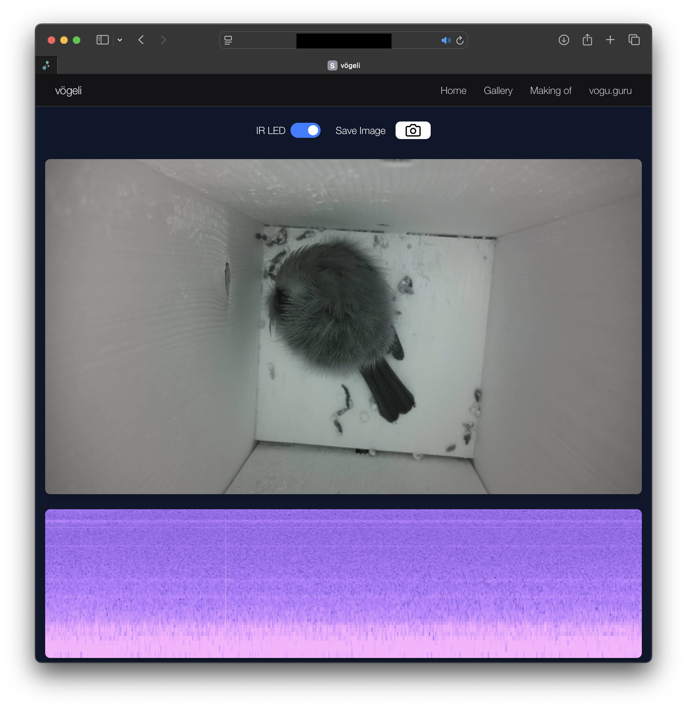

# Birdhouse

The birdhouse project consists sof two parts:
- birdhouse-rs, the webserver
- birdhouse-python, the camera control hosted on the raspberry pi in the birdhouse. 



The webserver is built with [Dioxus](https://dioxuslabs.com/).
The video feed is streamed to mediamtx and then proxied through the webserver with webRTC and using a turn server (coturn).

Multiple docker container are required for this project:
- dioxus webserver
- mediamtx server
- coturn server
- grafana

The raspberry pi and the server are connected using netbird.


## Setting it up:

First, set up [birdhouse-python](https://github.com/hacknus/birdhouse-python) on a raspberry pi along with the hardware (camera + sensors).
Then set up netbird on both the raspberry pi and the server.

Enter all tokens and URLs in the `.env` file.

To test it in development mode:
```
dx serve
```

To build the docker containers, first set up grafna, mediamtx and coturn docker containers and then
```
docker compose up -d --build
```

